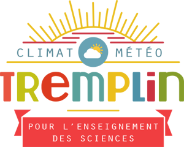
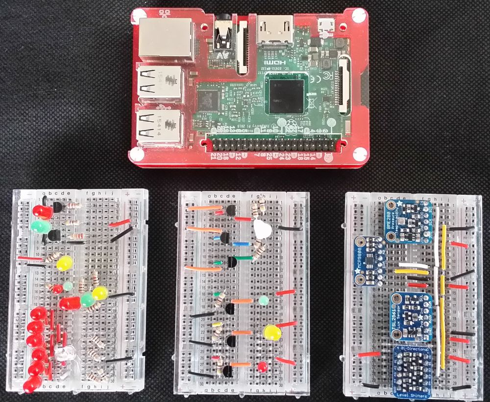

# Cahier de Programmes

Ensemble de cahiers de programmes permettant d'aborder le codage et la programmation avec des objets connectés (Raspberry Pi et Intel edison) et des interfaces de la vie quotidienne : jeux de lumière avec des diodes mesures météorologiques... Ces cahiers utilisent le logiciel [Jupyter](http://jupyter.org/) / [Jupyterhub](https://github.com/jupyterhub/jupyterhub) et permettent via une interface web de directement observer les résultats du travail en utilisant le langage python. Les cahiers sont directement exploitables en utilisant l'image pour raspberry Pi développée à l'IFÉ de l'ENS de lyon [disponible en ligne](http://mediaserv.climatetmeteo.fr/images/RaspBerry/DebianStretchPi3/), un blog d'accompagnement se trouve aussi [en ligne](http://blog.climatetmeteo.fr/GerardVidal/).

Cet outil peut aussi être utilisé pour produire des traces de l'apprentissage dans la même interface web. 

Trois thèmes sont abordés :

 * Les jeux de lumière
 * Un dispositif mixte : Led et Capteurs
 * Une microstation météorologique

Le matériel utilisé est représenté ci-dessous :

 * une raspberry pi modèle 3
 * une plaque de développement pour des jeux de lumière
 * une plaque de développement avec 3 diodes rouge jaune vert et une diode RGB
 * une plaque de développement portant un ensemble de capteurs météorologiques sur un bus 

